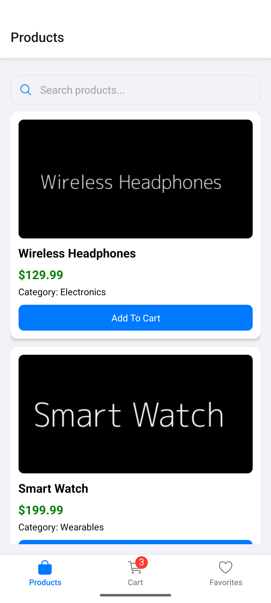
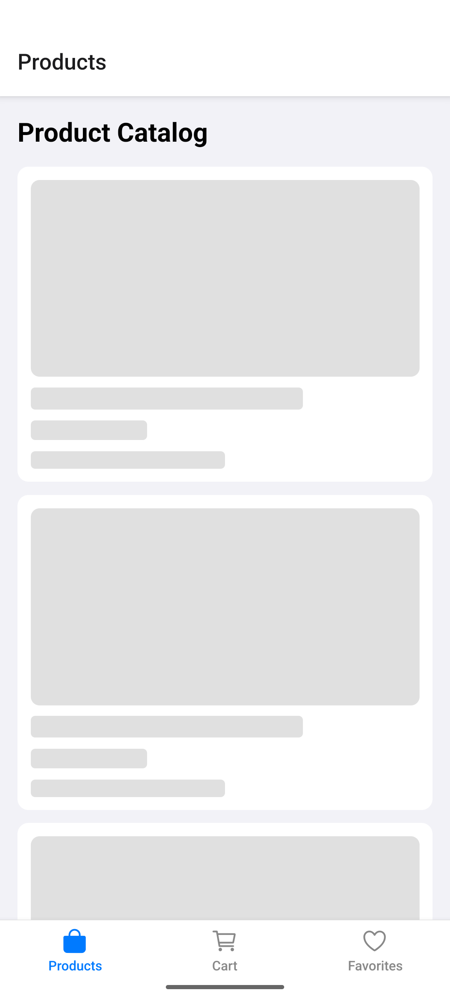
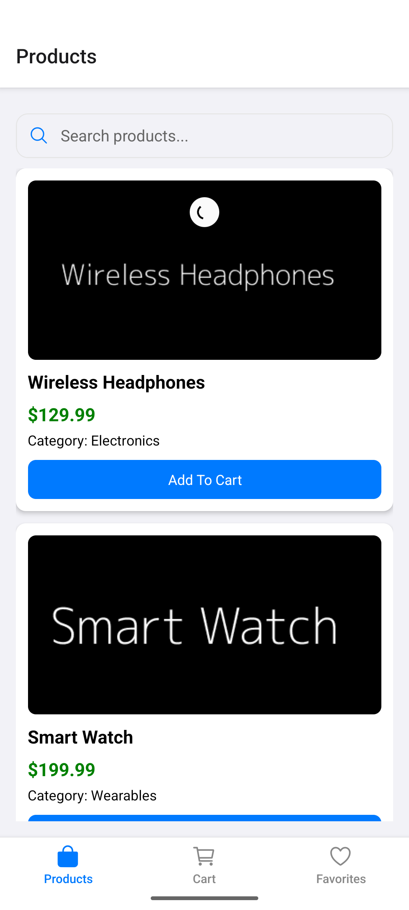
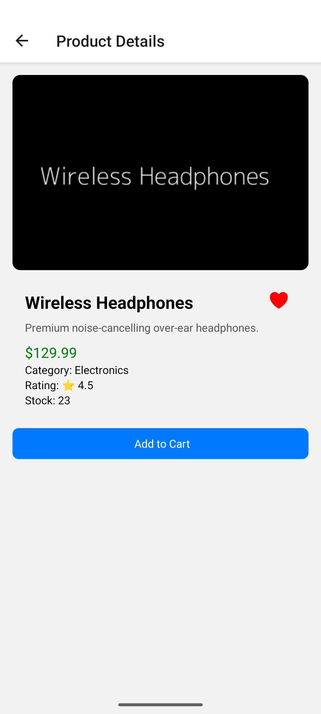
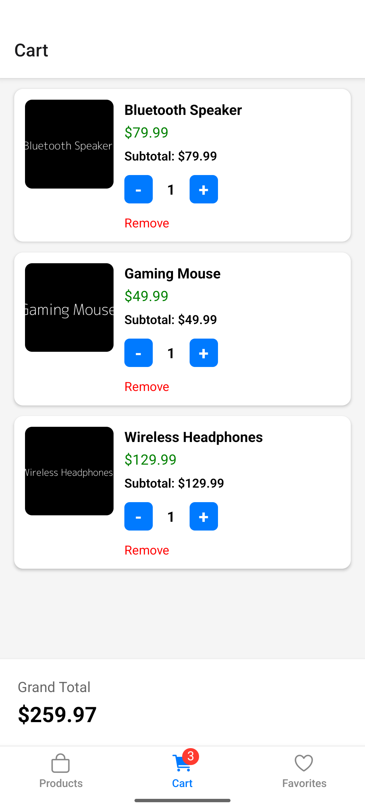
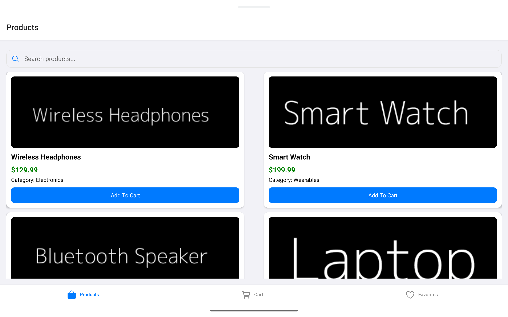
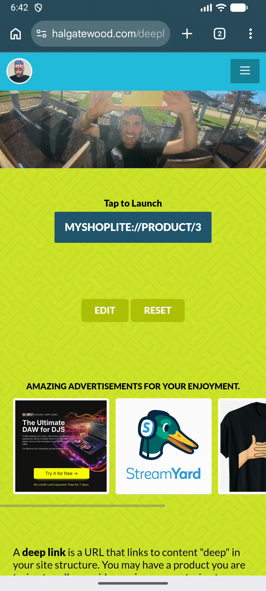

# ShopLite
A cross-platform React Native shopping application built with React Native, Redux Toolkit, React Navigation, and MockAPI. The application allows users to browse products, search products, view product details, mark favorites, and access product details through deep links.

## Project Setup Instructions

### Prerequisites
- Node.js (v18+ recommended)
- npm
- React Native development environment configured
- Xcode (for iOS)
- Android Studio (for Android)
#### Install Dependencies
npm install
#### Run on iOS
npm run ios
#### Run on Android
npm run android
#### Run on Web
npm run web

## Project Overview
### Description
ShopLite is a lightweight e-commerce application that demonstrates modern React Native development practices. The application fetches products from a REST API, displays them in a responsive layout, and allows users to manage favorite products.
### Technologies Used
#### Core Technologies
- React Native
- TypeScript
- React Navigation
- Redux Toolkit
- React Redux
- Axios
#### UI Libraries
- React Native Vector Icons (Ionicons)
- React Native Safe Area Context
#### Development & Testing
- Jest
- React Native Testing Library
#### Backend
- MockAPI REST Service

## Screenshots / GIFs

### 1. Product List Screen
Demonstrates:
- Product listing
- Search functionality
- Responsive layout
### Screenshot:
| ProductListScreen | ProductListScreen Loader |ProductListScreen PullToRefresh |
|--------------|----------------|----------------|
|  |  |  |

### 2. Product Details Screen
Demonstrates:
- Product details
- Product image
- Favorite toggle button

Screenshot:

### 3. Favorites Screen
Demonstrates:
- Favorited products list
- Remove favorite functionality

Screenshot:

### 3. Cart Screen
Demonstrates:
- Favorited products list
- Remove favorite functionality

Screenshot:

### 5. Responsive Design
Mobile Layout
- Single-column product layout

Web Layout/Tab 
- Two-column product layout

Screenshots:

| Mobile Layout | Web Layout/Tab  |
|--------------|----------------|
|  |  | 

### 6. Deep Link Demo
Deep link example:
- myshoplite://product/{id}

Demonstrates:
- Opening app from URL
- Navigating directly to Product Details screen

GIF/Screenshot:

| Android | iOS  |
|--------------|----------------|
|  |  | 

